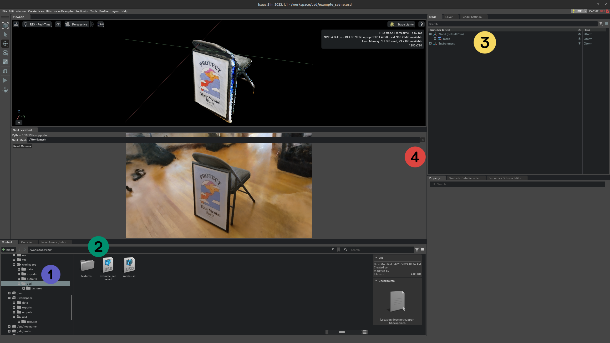
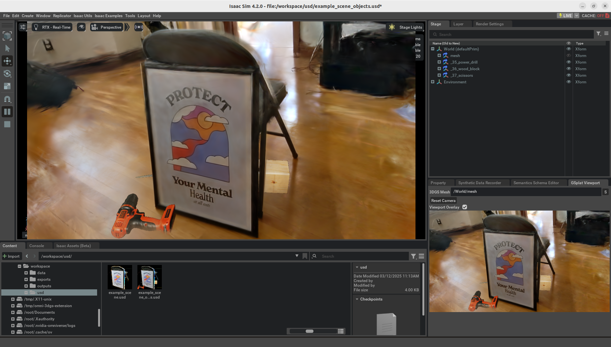

# Omniverse 3D Gaussian Splatting Extension

3D Gaussian Splatting (3DGS) extension for Omniverse.

> For Neural Radiance Field (NeRF) support, please refer to the [Omniverse NeRF Extension](https://github.com/j3soon/omni-nerf-extension).

For web streaming example, see the [omni-3dgs-streaming](https://github.com/j3soon/omni-3dgs-streaming) repository.

## Prerequisites

- **Hardware**:
  - CPU: x86
  - GPU: NVIDIA RTX GPU
  - See [this page](https://docs.omniverse.nvidia.com/isaacsim/latest/installation/requirements.html#system-requirements) for more details.
- **Operating System**: Ubuntu 20.04/22.04.
- **Software**:
  - [NVIDIA Driver](https://ubuntu.com/server/docs/nvidia-drivers-installation)
  - [Docker](https://docs.docker.com/engine/install/ubuntu/)
  - [NVIDIA Container Toolkit](https://docs.nvidia.com/datacenter/cloud-native/container-toolkit/latest/install-guide.html)
  - Omniverse Isaac Sim (through NGC Container)

> Other setup options provided by the community:
>
> **Non-Docker Setup**. For reproducibility, we only provide instructions on running both the renderer and the viewer inside docker containers. However, if you insist not using docker and are comfortable with resolving the dependencies by yourself, it is possible to run the renderer on the host (see [Issue #4](https://github.com/j3soon/omni-3dgs-extension/issues/4)), and the Isaac Sim viewer can also be run on the host (see [Issue #3](https://github.com/j3soon/omni-3dgs-extension/issues/3)).
>
> **Windows Support**. We only provide instructions for running on Ubuntu for simplicity. Nevertheless, if you really want to run it on Windows, you can use [Docker Desktop](https://docs.docker.com/desktop/setup/install/windows-install/) with the [WSL 2 backend](https://docs.docker.com/desktop/features/wsl/) to run the renderer backend. The viewer can be run on the Windows host. Some code changes to make zmq use tcp instead of ipc are required.
>
> **Without Isaac Sim**. Since Isaac Sim is basically Omniverse Kit with many extra features, we recommend using Isaac Sim directly for simplicity. However, we do provide instructions for running the viewer directly in Omniverse Kit through the [`kit-app-template`](https://github.com/NVIDIA-Omniverse/kit-app-template). See [omni-3dgs-streaming](https://github.com/j3soon/omni-3dgs-streaming) for further information.

## Demo

> TODO: Add more demo videos here.

**Note**: The datasets for these demos are not provided in this repository as they are casually collected. The purpose of these demos is to illustrate that this repository can be readily applied to a variety of custom datasets with extremely low effort. The following guide will use the `Poster` dataset for simplicity. To train your own dataset, please refer to [docs/training.md](docs/training.md).

## Setup

```sh
git clone https://github.com/j3soon/omni-3dgs-extension
cd omni-3dgs-extension
```

Download assets:

```sh
wget https://github.com/j3soon/omni-3dgs-extension/releases/download/v0.0.2/assets.zip
unzip assets.zip
```

Prepare assets for `vanillags_renderer`:

Rename the timestamp and checkpoint files to the same name as the placeholder for simplicity:

```sh
# change the DATE_TIME to the name of the placeholder
DATE_TIME=2025-02-19_105311
cp -r ./assets/exports/poster/splatfacto/$DATE_TIME ./assets/exports/poster/splatfacto/DATE_TIME
DATE_TIME=2025-02-19_121606
cp -r ./assets/exports/poster/nerfacto/$DATE_TIME ./assets/exports/poster/nerfacto/DATE_TIME
```

You can check if the renaming succeeded with the following command:

```sh
ls ./assets/exports/poster/splatfacto/DATE_TIME/splat/splat.ply
ls ./assets/exports/poster/nerfacto/DATE_TIME/tsdf/mesh.obj
```

The following also assumes that you are running the commands from the root of the repository.

## Managing Containers

Build the docker images for the extension:

```sh
docker compose build
```

Launch the containers:

```sh
# You might want to use `tmux` for exec-ing into the containers later
xhost +local:docker
docker compose up
```

Then follow the remaining sections.

To remove and stop the containers, run:

```sh
docker compose down
```

This project includes a custom 3DGS renderer (VanillaGS) and a frontend viewer (Isaac Sim). The renderer must be ran along with the viewer for correct visualization.

### VanillaGS Renderer

Code: [`vanillags_renderer`](./vanillags_renderer)

Attach to the container and start the renderer:

```sh
docker exec -it vanillags-renderer bash -ic "python /src/main.py"
```

and use the simple client to test the renderer:

```sh
docker exec -it vanillags-renderer bash -ic "python /src/client.py"
```

### (Optional) PyGame Viewer

Code: [`pygame_viewer`](./pygame_viewer)

Attach to the container and run the testing script:

```sh
docker exec -it pygame-viewer /src/run.sh
```

https://github.com/user-attachments/assets/8beea55b-b6ba-4a91-95c6-6fb8505a27db

> The latest version of the PyGame viewer contains a red plane with fixed distance to the camera.

### Isaac Sim Viewer

Code: [`extension`](./extension)

```sh
docker exec -it isaac-sim-viewer bash
# in container
/isaac-sim/runapp.sh --ext-folder /src/exts --enable omni.gsplat.viewport
```

> Alternatively, you can use WebRTC by running:
> 
> ```sh
> # in container
> /isaac-sim/runheadless.webrtc.sh --ext-folder /src/exts --enable omni.gsplat.viewport
> ```
> 
> Wait for the `Isaac Sim Headless WebRTC App is loaded.` message,
> and then visit <http://127.0.0.1:8211/streaming/webrtc-demo/?server=127.0.0.1> in Google Chrome.



1. Select the folder `/workspace/usd`
2. Open the file `example_scene.usd`
3. Click the mesh that you added in Step 2.
4. Press the button in 3DGS Viewport to update the input mesh of 3DGS.

https://github.com/user-attachments/assets/6da05279-73c5-4cdc-ba9a-33cd9fa28f65

For composition between Omniverse render and 3DGS, please refer to the following steps:

1. Select the folder `/workspace/usd`
2. Open the file `example_scene_objects.usd`
3. Click the mesh that you added in Step 2.
4. Press the button in 3DGS Viewport to update the input mesh of 3DGS.
5. Check the `Viewport Overlay` checkbox in 3DGS Viewport.
6. Press the `Play` button. The 3DGS Viewport will render the Omniverse-rendered depth.
7. Click the eye button of the mesh to hide it. The 3DGS Viewport will show the composition result.



If the viewer is grayed out, please check if the 3DGS renderer (VanillaGS) is running.

**Known Issues**:
- Cannot correctly handling non-uniform scaling of the object mesh yet.

## Rendering Backends

Currently supported rendering backends:

| Renderer | Code | Docker Image | Paper |
| -------- | ---- | ------------ | ----- |
| VanillaGS | [`j3soon/gaussian-splatting` (`bg-img-forward` branch)](https://github.com/j3soon/gaussian-splatting/tree/bg-img-forward) | [`j3soon/gaussian_splatting:bg-img-forward`](https://hub.docker.com/repository/docker/j3soon/gaussian_splatting/tags?name=bg-img-forward) | [SIGGRAPH 2023](https://arxiv.org/abs/2308.04079) |

Note that the depth test and alpha blending with Omniverse rendered background are intentionally implemented in the 3DGS rasterizer backend.

## Development Notes

### VanillaGS Renderer

After modifying code, you need to re-run the main renderer script. The docker container can be re-used since the code is mounted as a volume.

### PyGame Viewer

After modifying code, you need to re-run the testing script. The docker container can be re-used since the code is mounted as a volume.

### Isaac Sim Viewer

Setup VSCode intellisense for the extension:

```sh
cd extension
./link_app.sh --path "$HOME/.local/share/ov/pkg/code-2022.3.3"
# open the `extension` folder in VSCode
```

After modifying code, you can restart Isaac Sim to apply changes. The docker container can be re-used since the code is mounted as a volume. If the change is small, it is often faster to disable and re-enable the extension in the Isaac Sim UI. This can be done through `Window > Extensions > NVIDIA > General`, search `gsplat`, and then un-toggle and re-toggle the extension.

## Future Directions

- Communication between the renderer and the viewer is currently done through ZMQ IPC and JEPG compression. However it may be more efficient to use [CUDA IPC](https://github.com/NVIDIA/cuda-samples/tree/master/Samples/0_Introduction/simpleIPC) to bypass copy between GPU memory and CPU memory.
- Include more 3DGS renderers.

## Related Works

This project focuses on the simplest integration of various 3DGS renderers with Omniverse by intentionally decoupling the renderer backend from the Omniverse extension. This design enables easy future integration of advanced 3DGS renderers that use representations incompatible with Vanilla Gaussian Splatting, such as [Compact 3DGS](https://maincold2.github.io/c3dgs/), [Octree-GS](https://city-super.github.io/octree-gs/), and others. This allows for rapid prototyping without the need of standardizing the representation of 3DGS.

It is worth noting that advanced usages, such as those (shadows, reflections, refractions) proposed in [a talk from GTC Spring 2023](https://www.nvidia.com/en-us/on-demand/session/gtcspring23-s52163/), are out of scope of this project. The formal way to integrate 3DGS with Omniverse may need to somehow standardize the representation of 3DGS, and refer to methods such as [3DGUT](https://research.nvidia.com/labs/toronto-ai/3DGUT/) and [3DGRT](https://gaussiantracer.github.io/).

**2025/06 Update**: If you are only using VanillaGS and don't need custom 3DGS backend support, we now have an official (beta) feature that allows [converting PLY files to special USDZ files](https://github.com/nv-tlabs/3dgrut?tab=readme-ov-file#converting-ply-files-to-usdz) and can be used directly in Omniverse Kit (or Isaac Sim). See [3DGRUT's Exporting USDZ for use in Omniverse and Isaac Sim](https://github.com/nv-tlabs/3dgrut?tab=readme-ov-file#exporting-usdz-for-use-in-omniverse-and-isaac-sim) for more details. There is also a document on Omniverse's [Neural (NuRec) Rendering](https://docs.omniverse.nvidia.com/materials-and-rendering/latest/neural-rendering.html) feature. These features are available since Omniverse Kit 107.3 and Isaac Sim 5.0.

This project originated as a feature branch of the [j3soon/omni-nerf-extension](https://github.com/j3soon/omni-nerf-extension). However, the branch has diverged significantly and we decided to maintain this project separately. Key differences include:

- Switched to ZMQ instead of RPyC for communication between the renderer and viewer, enabling full decoupling of codebases since RPyC requires matching Python versions.
- Uses Inter-Process Communication (IPC) instead of network communication for faster data transfer between the renderer and viewer.
- Removed progressive rendering since 3DGS rendering is much faster than NeRF and doesn't require it.
- Directly invoke the 3DGS renderer instead of using the Nerfstudio pipeline to enable easier integration of different 3DGS renderers, avoiding tight coupling with the Nerfstudio codebase which is difficult to trace and maintain.

There are also other projects that attempt to integrate 3DGS with Omniverse, such as [tangkangqi/omni-gaussian-splatting-extension](https://github.com/tangkangqi/omni-gaussiansplating-extension). However, I haven't tried them yet.

## Acknowledgement

This project has been made possible through the support of [CGV Lab][cgvlab], [VMLab][vmlab], and [NVIDIA AI Technology Center (NVAITC)][nvaitc].

Special thanks to [@tigerpaws01](https://github.com/tigerpaws01) for the initial implementation of the PyGame viewer.

I would also like to thank the large-scale 3DGS Study Group members, [@Joshimello](https://github.com/Joshimello), [@Sunnyhong0326](https://github.com/Sunnyhong0326), and Ting-Yu Yan for discussions.

For a complete list of contributors to the code of this repository, please visit the [contributor list](https://github.com/j3soon/omni-3dgs-extension/graphs/contributors).

[cgvlab]: https://cgv.cs.nthu.edu.tw
[vmlab]: https://vmlab-nthu.notion.site/NTHU-VMLab-143b8d611ddc8071ab0ede97aacfc403?pvs=4
[nvaitc]: https://github.com/NVAITC

Disclaimer: this is not an official NVIDIA product.
